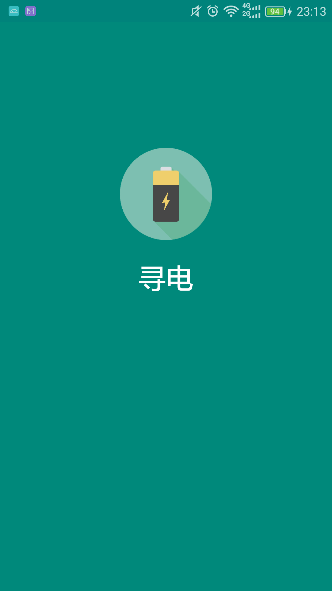
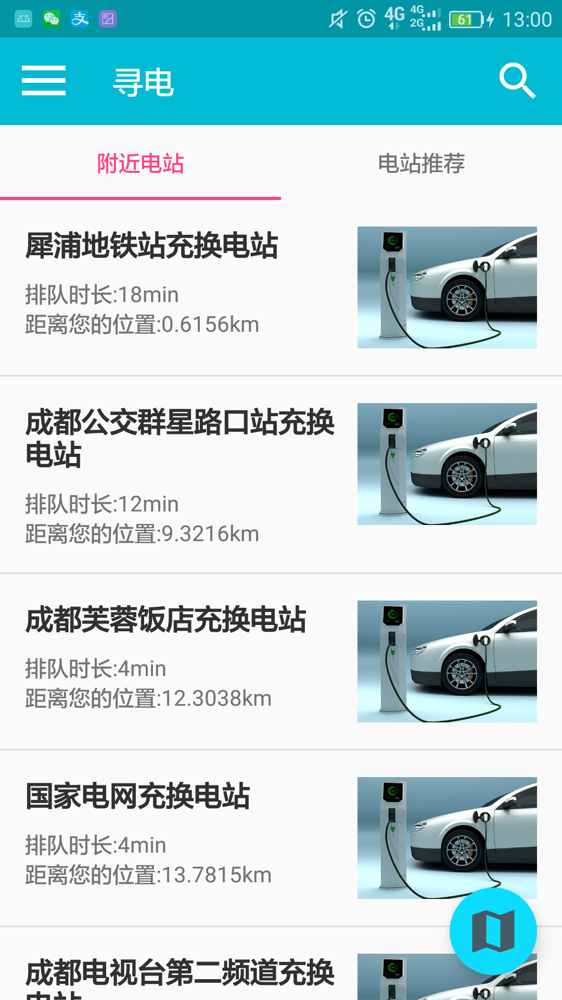
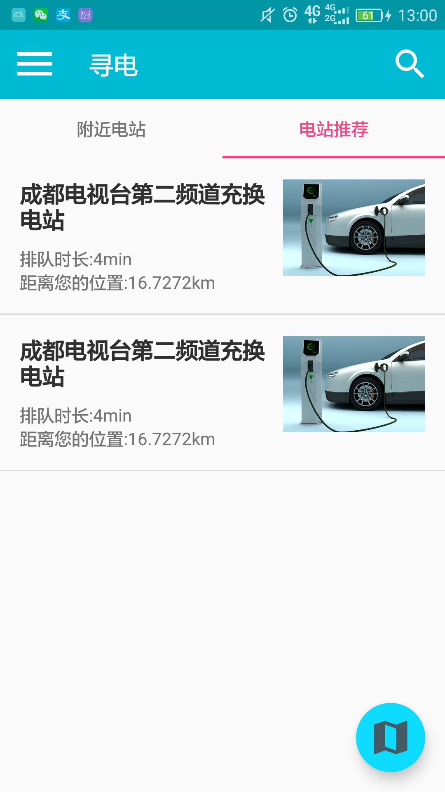
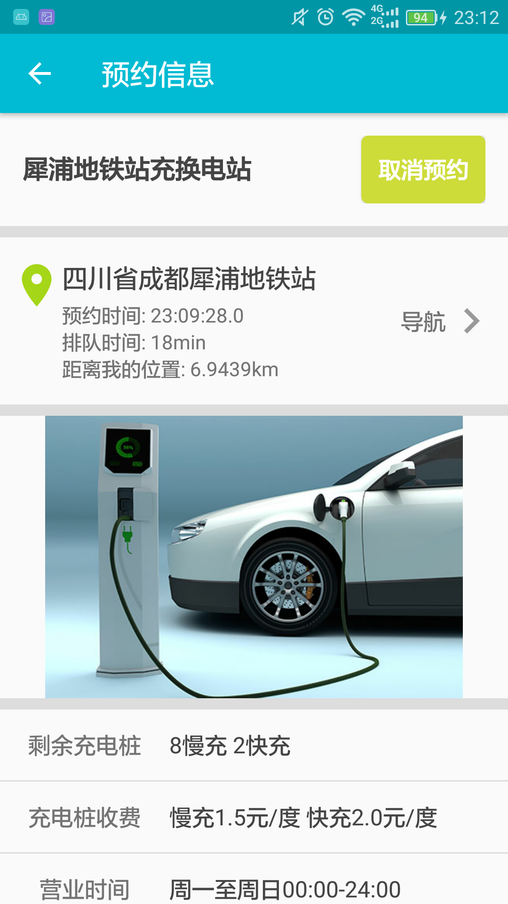
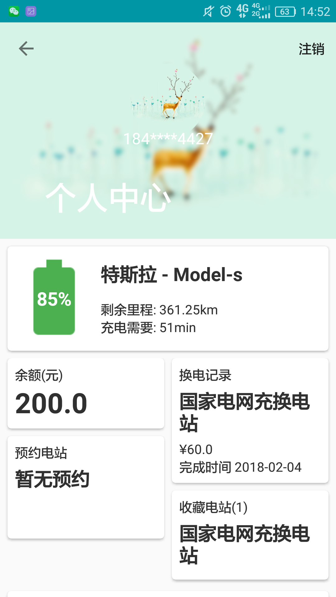
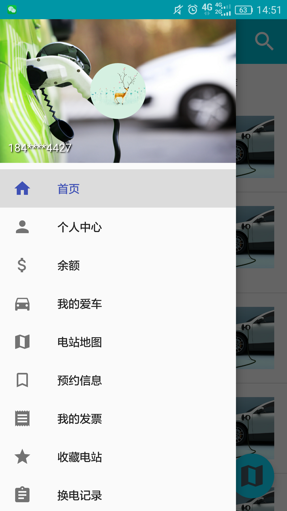
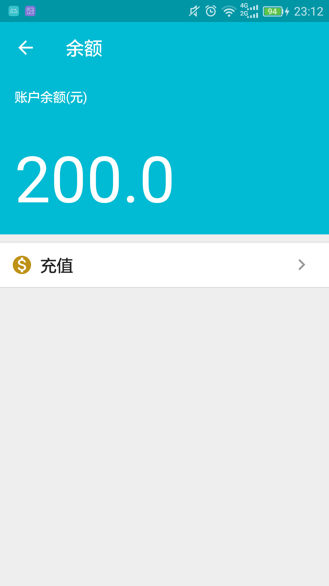
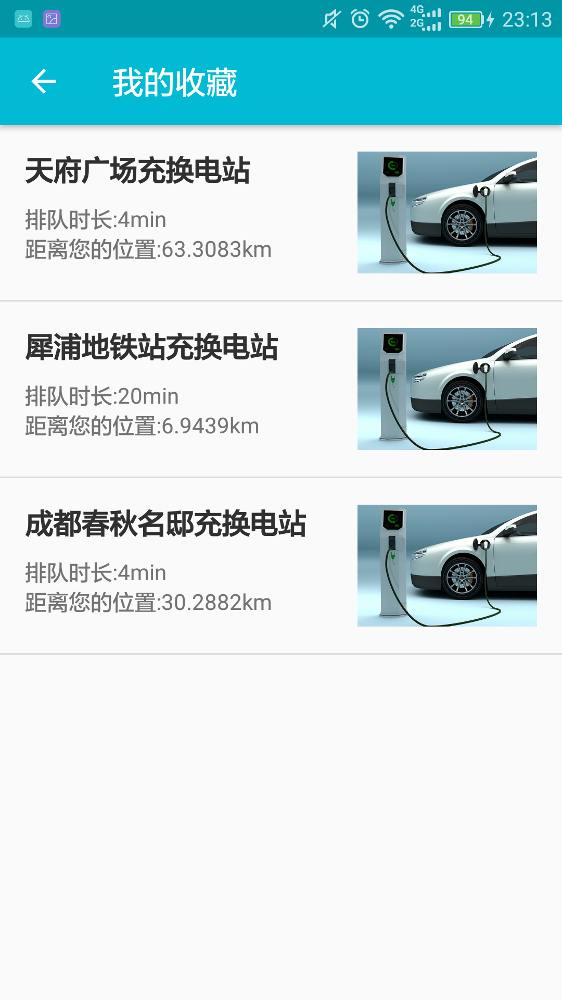
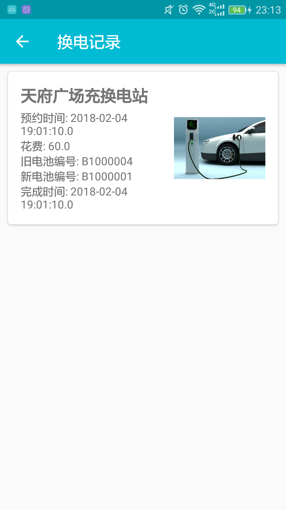
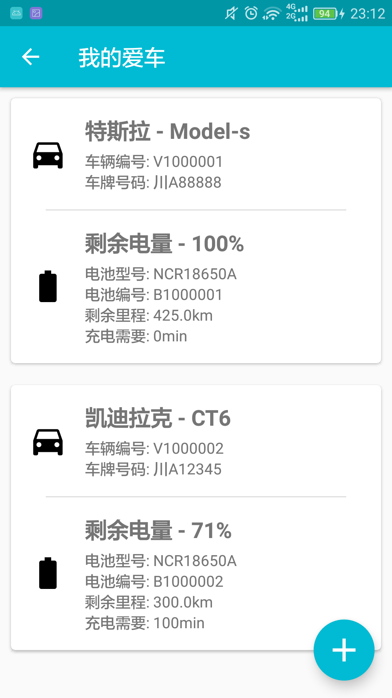

# 共享电池APP项目
- 服务器详见BatteryServer项目

## 产品介绍
- 本应用为电动汽车车主用户提供便捷的续航服务
- 主要体现在智能引导车主进行电池更换
- 截图一览
- 
- 
- 
- 
- 
- 
- 
- 
- 
- 

### 目的与意义
- 在能源限制，环境污染的大背景下，节能环保的新能源电动汽车应运而出，展示出强大的发展潜力。但由于目前各类电动汽车充电
标准不一、充电桩分布不均匀、充电时间长、车主完成一次充电过程往往费时费力。
- 当前电动汽车的充电问题仍然是制约电动汽车行业发展的主要因素。因此我们提出“共享电池，以换代充”的概念，大大降低了电动
汽车恢复续航能力所需要的时间；换电过程“即停即走”，也避免的“固定式充电桩”的车位占用问题，为车主提供方便，也为电动汽车
行业的发展提供新的模式探索方案。
- 本作品基于车联网、大数据的背景开发新的电池管理系统和APP交互系统，旨在为车主提供快捷服务和提升用户群体的换电效率，
通过对大量电池生命周期数据的采集和智能优化算法的引导来降低运营成本和资源浪费。因此，本系统研发成果具有较好的实用价值
和未来发展潜力。

### 相关项目研究国内外研究现状
- 国内研究方面，研究主要集中在仿真模拟和策略规划的层面上。比如，我国学者张海龙等对电动汽车充换电服务网络运营管理系统
进行了研究与设计，张昌华等建立了换电模式下电动汽车换电充裕度模型并进行仿真模拟，田文琦等对电动汽车换电站有序充电调度
策略进行了研究。
- 国外研究方面，由于电动汽车在发达国家兴起较早，基于优化换电策略、开发高效电池管理储蓄系统的研究较多，充换电模式的
探讨和实践也较为成熟。
- 实际应用方面，根据所服务车辆类型的不同，投入使用的换电站主要可以分 3 类：综合型换电站、商用车电池更换站和乘用车
电池更换站。目前，国内在北京、上海、杭州等城市已建设有商用车和乘用车电池更换站。在国际上，以色列的
Better Place（BP）公司较早采用了这种充换电模式，其业务模式主要是通过建设充换电设施网络为电动汽车用户提供基础设施
及能源供给服务 。这种电动汽车充换电模式在加拿大、澳大利亚、丹麦等国也已经有了现实的应用和推广。Better Place 也与
中国南方电网签订了战略合作协议，目前已在广州建成一个电池换电站及体验中心。

## 更新说明
### 1月31日更新
- 使用自动生成的底部导航活动(Bottom navigation activity)创建了一个主活动HomeActivity
- 为主要各实体创建对应的类
- 添加了允许使用Internet的权限
- 添加了使用OkHttp的依赖
- 测试了APP同服务器直接的连接通信，解决字符编码问题

### 2月2日更新
- 完善了各实体类
- 通过向sqlite数据库预存一位用户的手机号和密码来测试自动登录，目前只测试以保存一位用户的手机号和密码的情况下，自动
登录的功能
- 实现了登录验证的逻辑
- 实现了登录后，根据用户id获取用户的爱车信息，以及爱车附近的电站信息的相关逻辑
- 一些线程的开启和阻塞的问题有待深入研究，目前暂且无碍

### 2月3日更新
- 实现了车辆请求电池数据的逻辑
- 与服务器项目同步了一些实体类的属性

### 2月4日更新
- 各实体类中用于表示时间的属性Timestemp对象更换为String对象，值由Date类和SimpleDateFormat类构造生成
- 实现了向服务器请求并接收用户预约信息、用户换电记录、用户收藏的电站的逻辑
- 实现了用户预约电站的业务逻辑
- 实现了用户询问服务器预约是否完成的逻辑，此逻辑应该定时向服务器询问直至预约完成或预约取消
- 各实体类中http通信部分代码结构略显粗糙，有待改善

### 2月5日更新
- 增加了UserVehicle类与服务器数据库中的user_vehicle数据表相对于，以便于User类中发送HTTP请求
- 将一些发送HTTP请求的代码迁移到其自身的实体类中，使用load()方法根据实体自身的id向服务器请求其自身的其他数据，使得
代码语义上更加通顺

### 3月2日更新
- 添加了前端页面显示，并加以优化
- 增加了对Material Design的运用
- 目前大部分HTTP请求在活动中完成而不是在各实体类
- 云服务器已上线，以将IP改为公网IP，详见BatteryServer项目
- 更新的太多，记不全了……